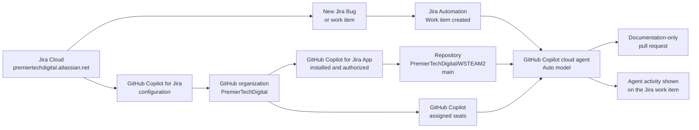
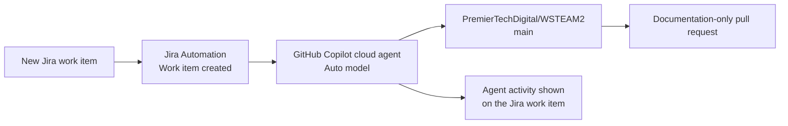

# GitHub Copilot for Jira

This repository records the team setup for GitHub Copilot for Jira. It is intended as the operational reference for the `PremierTechDigital` GitHub organization and the `premiertechdigital.atlassian.net` Jira Cloud site.

## Current configuration

| Setting                 | Value                                                       |
| ----------------------- | ----------------------------------------------------------- |
| Jira site               | `https://premiertechdigital.atlassian.net/`               |
| GitHub organization     | `PremierTechDigital`                                      |
| Repository              | `PremierTechDigital/WSTEAM2`                              |
| Intended scope          | All Jira projects                                           |
| Configuration account   | `FrancoisFoster`                                          |
| Organization connection | Connected in the GitHub Copilot for Jira configuration page |

The GitHub Copilot for Jira configuration page shows `PremierTechDigital` as a connected organization. This establishes the organization-level connection; access is governed by each person's GitHub Copilot entitlement and their existing Jira and GitHub permissions.

## Missing prerequisite for Jira Rovo MCP access

The missing prerequisite is repository-level Copilot environment configuration for Jira MCP credentials. Without these values, Copilot sessions cannot query Jira items directly.

Configure these in the repository `copilot` environment:

- Variable: `COPILOT_MCP_JIRA_SITE_URL` (example: `https://premiertechdigital.atlassian.net`)
- Variable: `COPILOT_MCP_JIRA_USER_EMAIL`
- Secret: `COPILOT_MCP_JIRA_API_TOKEN`

The Copilot setup workflow now validates that these prerequisites exist and reports warnings when they are missing.

## Setup flow



## Administrator completion checklist

1. Open the GitHub Copilot for Jira configuration page in Jira as a Jira administrator.
2. Confirm that the signed-in GitHub account is authorized to administer `PremierTechDigital`.
3. Confirm that `PremierTechDigital` appears under **Connected organizations**.
4. If the page still shows **Install app**, select it and complete the GitHub App authorization flow for `PremierTechDigital`.
5. In GitHub, confirm that the installed app has access to the intended repositories. If it uses selected-repository access, include `WSTEAM2`.
6. Assign GitHub Copilot seats to the people who should use Copilot features.
7. Keep Jira project access and GitHub repository permissions aligned with the team's normal least-privilege model.

## What team members need

Each person needs:

- A Jira account with access to the relevant project and work items.
- A GitHub account that can access the relevant repository.
- An active GitHub Copilot subscription or organization-assigned Copilot seat.

No separate Jira-project-by-project enablement is expected for this organization connection. Existing Jira project and GitHub repository permissions still determine what each person can see or act on.

## Validation

Use a real Jira work item and repository change to confirm the integration:

1. Choose a Jira work item, for example `ABC-123`.
2. Create a branch containing the work-item key, such as `ABC-123-copilot-jira-validation`.
3. Use GitHub Copilot as appropriate for the change, then open a pull request that references `ABC-123`.
4. Open the Jira work item and confirm that its development information shows the related branch and pull request.
5. Confirm that an authorized team member can access the Copilot for Jira experience without seeing projects or repositories outside their normal permissions.

## Important distinction

GitHub for Jira development links and GitHub Copilot for Jira are related but distinct integrations:

- **GitHub for Jira** connects branches, commits, pull requests, builds, and deployments to Jira work items.
- **GitHub Copilot for Jira** provides the Copilot-specific Jira integration and requires both an active Copilot entitlement and the corresponding Jira app installation.

The connection does not override Jira permissions, GitHub repository access, or GitHub Copilot licensing.

## Automation pilot

The first pilot uses Jira Automation to trigger GitHub Copilot cloud agent when a new work item is created. Copilot uses the Jira work item as context and opens a pull request in `PremierTechDigital/WSTEAM2`.



The GitHub Copilot action starts a coding-agent session; it does not automatically write an AI response into a Jira custom field. The supported output is agent activity in Jira and a pull request in GitHub. A separate Jira/Rovo agent or an external service that calls an AI model and the Jira REST API is required for unattended custom-field updates.

### Pilot prompt

Use this prompt in the Jira Automation action:

```text
Review Jira work item {{issue.key}} and use its title, description, request type,
labels, and comments as context. Work only in PremierTechDigital/WSTEAM2 on the
main branch. Do not modify application code. Create triage/{{issue.key}}-summary.md
with sections for Summary, Impact, Reproduction clues, Suggested next steps, and
Clarifying questions. Open a pull request for review.
```

## Security

Do not place GitHub personal access tokens, Atlassian API tokens, or Opsgenie API keys in this repository, Jira tickets, pull requests, screenshots, or documentation. Store automation credentials in an approved secret manager and rotate any credential accidentally exposed in a shared location.
